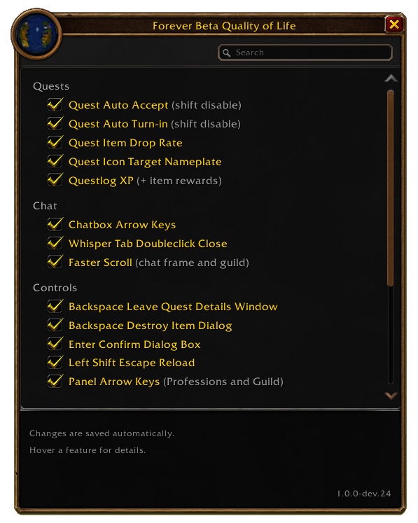
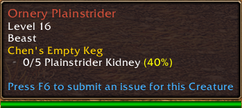
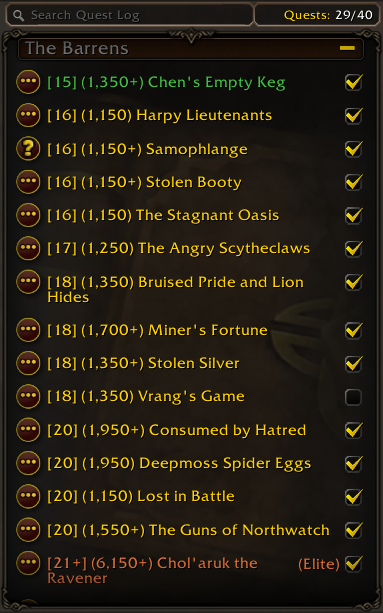
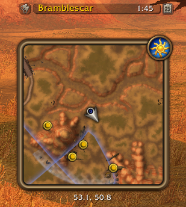

# Forever Beta Quality of Life

**Version 1.0.0-dev.25 (prerelease)** | WoW Forever Beta 1.60.1 | Interface 16001 | No dependencies.

Open settings with `/qol` or the Mana button on the minimap.
[Installation](#installation-and-updates) | [Settings](#settings-window) | [License](#license-and-data-attribution)

  
   
  <em>Native-style settings, opened with /qol or the minimap button. Menu capture: dev.24; the current feature names are listed below.</em>

## Features

All 19 switches start enabled on a fresh installation. Existing saved choices
are preserved. The groups below match the settings window.

### Quests

- **Quest Auto Accept (shift disable):** Automatically accepts ordinary NPC quest offers.

- **Quest Auto Turn-in (shift disable):** Automatically turns in completed NPC quests.
  Multiple reward choices and quests requiring gold remain manual.

- **Quest Item Drop Rate:** Adds a percentage in the quest title's yellow directly after each matching quest item
  in the standard mob tooltip, for example `0/5 Plainstrider Kidney (40%)`.
  Only your own item quests still in the quest log are included.
  At full progress (such as 5/5), the percentage inherits the item row's gray.
  Remains visible until turn-in or abandonment.
  Display rounds to whole percentages. At or above 19%, it uses a 5% step only
  when the raw rate is within 1 percentage point of that step (69.4% -> 70%,
  20.5% -> 20%, but 27.8% -> 28%). Positive values rounding to zero display `<1%`.
  Thus 19-21% -> 20%, 24-26% -> 25%, 29-31% -> 30%, and so on.
  Below 19% and between these bands, standard whole-percent rounding applies.
  Original data is retained.
  Uses a local database with Questie Forever v27 Classic estimates and 337 additional
  NPC/item pairs from Wowhead Forever observations, covering 176 items and 283 NPCs.
  All 2,133 pages in the September 25 quest-item catalog were parsed successfully.
  The combined lookup contains 17,015 pairs across 4,400 NPCs and 1,407 items.
  This includes new Forever items and new sources for existing quest items, such as
  Razormane Raider / Bristleback Quilboar Tusk (70%). No extra addon is required.
  **Classic values are transferred estimates; Forever values are observed loot frequencies,
  not guaranteed server drop probabilities.** Samples may be small or include players
  without the relevant quest. They are not a per-kill guarantee or automatically updated.
  Unknown drops and ambiguous item names are omitted. A complete catalog fetch
  does not provide usable rates for every quest item;
  new quests can use known pairs, while new unknown NPC/item pairs need a data update.
  Quest progress and nameplate markers already use the current client's quest data.
  Group members' objectives do not trigger the display. Enabled by default.
  [Data sources, license and reproduction](Data/NOTICE.md).

  
   
  <em>Quest-item percentages appear directly beside objective progress.</em>

- **Quest Icon Target Nameplate:** Shows a small bag to the left of a mob's standard nameplate
  while it contributes to one of your unfinished quest objectives (items, kills, or
  interactions). Hides when that mob's relevant goals are complete. Enabled by default; toggle it in `/qol`.

- **Questlog XP (+ item rewards):** Shows the XP reward between quest level and title in
  the quest log overview, for example `[16] (4,400) Returning the Lost Satchel`.
  Adds `+` when guaranteed or selectable item rewards are available, such as
  `(4,400+)`. Uses the current client reward value and number formatting. Missing or hidden
  rewards are omitted; disabling restores the standard titles.

  
   
  <em>Quest level, XP and item rewards at a glance: [15] (1,350+) Chen's Empty Keg.</em>

### Chat

- **Chatbox Arrow Keys:** Use Left/Right to move the cursor and Up/Down for
  input history without holding Alt while a standard chat input has focus. Also
  works in new whisper windows. Remembers up to 32 entries per chat input during
  the current session, starting when the addon loads. Protected commands such as
  `/cast` remain in the native Alt+Up/Down history. Disable to restore the previous
  arrow-key mode.

- **Whisper Tab Doubleclick Close:** Close a regular or Battle.net whisper tab
  with a left double-click, using the same close action as its context menu.

- **Multiline Scroll (chatframe and guild):** Scroll three lines per mousewheel
  step in standard chat windows, including `/g`. The separate Guild/Communities
  window already scrolls three entries natively and remains unchanged. Disabling
  restores the previous mousewheel handler. On client versions already using
  three lines in ordinary chat, enabling keeps that speed rather than multiplying it.

### Controls

- **Backspace Leave Quest Details Window:** Press Backspace in the quest log details to
  activate the native Back button and return to the overview. Enabled by default
  with its own `/qol` switch. Works outside
  combat; typing, modified keys and picked-up items keep their normal behavior.

- **Backspace Destroy Item Dialog:** Press Backspace with an item picked up from
  your bags to open its normal delete confirmation. Works outside combat;
  Backspace keeps its usual behavior in text fields and without a picked-up item.
  Split stacks are excluded; whole items and whole stacks are supported.

- **Enter Confirm Dialog Box:** Confirms the main button of standard WoW dialogs
  with Enter, including selling junk, deleting items, purchases and party invitations.
  Required confirmation text must still be entered; Escape cancels.

- **Left Shift Escape Reload:** Hold the left Shift key and press Escape to reload
  the UI. Enabled by default with its own switch in Controls.
  Observes keyboard input directly without changing bindings. Right Shift alone,
  Ctrl/Alt combinations and ordinary Escape do not trigger a reload. The initial
  keyboard listener setup waits until combat ends if necessary.

- **Panel Arrow Keys (guild and professions):** Use Up/Down to select the
  previous/next recipe in the open professions crafting page, or scroll the visible
  Guild/Communities chat by three lines. Recipe navigation skips category headings
  and collapsed or filtered recipes, and scrolls the selection into view.
  Holding a key in Professions repeats after 0.5 seconds, then once every 0.1
  seconds, matching the native scrollbar stepper timings. Guild/Communities uses
  a shorter 0.25-second delay and 0.05-second repeats. Releasing the key, hiding
  the window or starting text input stops it.
  Direction changes restart the delay; selection stops at list boundaries.
  When both panels are visible, the higher frame-level window receives the keys
  (professions takes priority on a tie); they never both navigate at once.
  Text input, modified keys
  and combat retain their normal behavior. Does not craft anything.

### World & Interface

- **Fast Autoloot:** Speeds up native auto-looting and hides the loot window.
  Manual looting remains available when an item cannot be collected automatically.

- **Square Minimap (forever look):** Displays the standard minimap as a square with rounded corners and a
  bronze-toned WoW-style border. The day/night icon sits at the top-right corner
  and the group-finder eye at the bottom-left. Disable to restore the round map
  and native icon positions. Map position, size, and button actions are preserved.
  Enabled by default; toggle it in `/qol`.

  
   
  <em>A rounded square minimap with the Forever-style bronze border.</em>

- **Flight Master Auto Map (shift disable):** Opens the flight map automatically when the NPC offers
  the standard flight-master dialog. Enabled by default, independently switchable under
  `/qol`. Hold Shift when speaking to the NPC to keep the entire conversation manual,
  even after releasing Shift. Quest acceptance
  and turn-in retain priority when enabled. Choose your destination on the map as usual.

### Spells

- **Spellicon Range Color:** Colors the whole spell icon red when it is out of
  range, then restores the normal icon color when it is back in range.

- **Low Spell Rank Check (at launch):** Once after login or `/reload`, compares each spell's
  highest rank on your mouse/keyboard action bars with its highest learned rank.
  If the highest learned rank is on a bar, additional lower ranks do not trigger
  a warning. Otherwise, one message per spell names the available higher rank.
  Spells completely absent from these bars are ignored. The check waits until
  combat ends when necessary; it never changes your bars. Direct player spell
  actions only: conditional macros, separate gamepad storage, pet bars and
  unlearned trainer spells are not checked. Enabling takes effect at the next
  login/reload.
  Example: `BetaQoL: Smite Rank 3 available. Check your spellbook.`
  The `BetaQoL:` prefix is red.

- **Missing Spell Check (at launch):** Independently checks whether
  each active learned spell outside the spellbook's General category has any
  rank on your mouse/keyboard action bars. One message per missing spell, for
  example `BetaQoL: Smite not in actionbar.`, with a yellow `BetaQoL:` prefix.
  General, passive abilities, unlearned and off-spec entries are excluded.
  Shares the rank check's direct-action scope, login/reload timing and combat
  deferral. Does not place spells or alter your bars. Enabled by default; its
  separate `/qol` switch applies at the next login/reload.

## Settings window

Click the Mana icon on the right edge of the minimap or type
`/qol` to open or close the compact settings window in the native LFG style.
The button uses the client-provided [Primal Mana icon](https://www.wowhead.com/forever/de/icon=132849/inv-elemental-primal-mana)
and stays available with Square Minimap enabled or disabled. It follows the
minimap scale; creation and repositioning during combat wait until combat ends.

All categories appear in one list with indented feature checkboxes.
Search by feature or category name; click a category heading to collapse it.
Click a feature name or its checkbox to toggle it. Hover either for a description
and usage notes. The frame keeps the native title bar and border, with dark
gray rock textures, with no LFG scenery. The window measures 458 x 582 and is
titled **Forever Beta Quality of Life**. Parenthetical qualifiers are gray.
A smaller search box sits on the right of the compact upper strip.
The footer has one continuous textured background behind its hints and version.
The two bottom-left layout buttons are hidden; existing saved layout choices
remain in effect.
Drag the window to move it and press Escape to close it.

## Installation and updates

1. Download **BetaQoL-1.0.0-dev.25.zip** from the
   [current prerelease](https://github.com/Kirchlive/forever-beta-quality-of-life/releases/tag/v1.0.0-dev.25).
   For the previous stable version, use [Latest stable](https://github.com/Kirchlive/forever-beta-quality-of-life/releases/latest).
2. Extract the `BetaQoL` folder into
   `World of Warcraft\_classic_beta_\Interface\AddOns\`.
   `BetaQoL.toc` must be directly inside `AddOns\BetaQoL`. Keep the included `Media` and `Data` folders.
3. For a first installation, restart WoW and enable **Beta Quality of Life**.
   For updates, replace the files and run `/reload`.

**Updating from 0.9.7:** Damage Meter Doubleclick Switch has been removed after
reproducible Lua errors. Its menu entry and obsolete saved setting are removed;
use Blizzard's normal Current/Overall menu. Reload after updating to clear any
previously affected runtime state. If you enabled diagnostic logging during testing,
run `/console taintLog 0` before reloading. All other existing features remain available.

## Usage

- `/qol`: Open the settings window with one checkbox per feature. Available features
  start enabled. Most changes apply immediately; spell checks run at the next
  login or reload. Existing saved on/off choices are preserved
  when the client restores SavedVariables. Settings are shared across characters on the account.
- `/betaqol` or `/fqa`: Toggle Quest Auto Accept and save the choice.
- Hold Shift when opening a quest conversation to pause both acceptance and turn-in
  for that entire conversation, even after releasing Shift.
- Enable Auto Loot in WoW for Fast Autoloot. The native auto-loot modifier still works.
- Quest Auto Turn-in has its own switch and works with Auto Accept disabled.
  It collects a sole reward automatically; choosing between rewards stays manual.
- Enter supports standard Blizzard popups; custom windows may need separate integration.
- Range coloring follows WoW's range checks on its standard action bars.
  Custom replacement bars and pet bars are not covered.
- Double-click the whisper tab itself with the left mouse button to close it.
  Single-click selection, right-click menus, and other chat tabs work as usual.
- Pick up an item from your backpack or carried bags, then press Backspace.
  Confirm the native dialog to destroy it, or cancel to keep it. Required
  confirmation text is preserved. No permanent key binding is changed.
- Square Minimap supports Blizzard's standard minimap. Icon repositioning during
  combat applies after combat ends. Custom minimap replacements are not covered.

- Quest markers use the quest objectives supplied by the client for each NPC.
  Objectives absent from the native tooltip cannot be inferred. Group members'
  objectives do not keep your completed marker visible. Custom nameplates are not covered.

If settings reset after a restart, check whether the client restored `BetaQoLDB`
from SavedVariables. A [community report and workaround](https://github.com/nobewayo/ForeverSVFix)
describes this issue in Forever beta builds. That workaround is not bundled here.

## License and data attribution

Original addon code, tools, tests, documentation and generated minimap artwork
are licensed under [MIT](LICENSE), copyright 2026 Kirchlive and contributors.
The bundled Questie-derived database and original source tables retain their
**GPL-3.0** license. Wowhead observations and third-party artwork have separate
attribution; the MIT grant does not relicense them. See
[THIRD_PARTY_NOTICES.md](THIRD_PARTY_NOTICES.md) and [Data/NOTICE.md](Data/NOTICE.md).

## Release status and documentation

This is **1.0.0-dev.25**, a prerelease. The final version 1.0.0 has not been published.
The feature set, settings window, minimap access and MIT code license are in place.
Four supplied in-game screenshots illustrate the current layout and features;
the menu capture predates the final label changes. Remaining work: final live-client
review, refresh the menu capture for 1.0.0, confirm the supplied portrait's
source/reuse rights, and prepare the final versioned release.
Damage-meter switching and Shoot spam remain excluded.

- [CHANGELOG.md](CHANGELOG.md): concise release overview.
- [CONTRIBUTING.md](CONTRIBUTING.md): development, tests and behavioral contracts.
- [RELEASE.md](RELEASE.md): final live checks, screenshots, packaging and publication.
- [DEVLOG.md](DEVLOG.md): detailed historical research and implementation notes.
- [Data/RESEARCH.md](Data/RESEARCH.md): quest-data sources reviewed and integration decisions.
